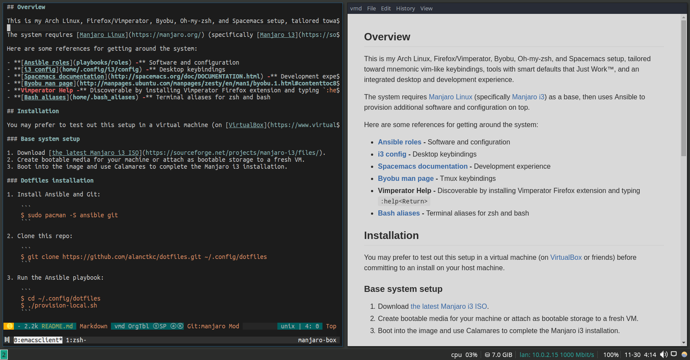

### WIP README STUFF

```shell
wget -q -O - https://raw.githubusercontent.com/alanchrt/dotfiles/regolith/bootstrap.sh
```

## Overview

This is my NixOS, i3, Spacemacs, byobu, and oh-my-zsh setup, tailored toward mnemonic vim-like keybindings, tools with smart defaults that Just Work&trade;, and an integrated desktop and development experience.



The system requires the [NixOS Installer](https://nixos.org/nixos/download.html) and a fresh partition before install. Note that, by default, a user named `alan` is configured. You will need to fork this repo and configure for your own user.

Here are some references for getting around the system:

- **[i3 config](home/.config/i3/config) -** Desktop keybindings
- **[Spacemacs documentation](http://spacemacs.org/doc/DOCUMENTATION.html) -** Development experience
- **[Byobu man page](http://manpages.ubuntu.com/manpages/zesty/en/man1/byobu.1.html#contenttoc8) -** Tmux keybindings
- **[Bash aliases](home/.bash_aliases) -** Terminal aliases for zsh and bash

## Installation

You may prefer to test out this setup in a virtual machine (on [VirtualBox](https://www.virtualbox.org/) or friends) before committing to an install on your host machine.

### Set up the base system

1. Download [the latest NixOS Installer ISO](https://nixos.org/nixos/download.html).
2. Create bootable media for your machine or attach as bootable storage to a fresh VM.
3. Boot into the image, create the disk, and mount it. You may need to refer to the [NixOS Manual](https://nixos.org/nixos/manual/index.html#sec-installation).

### Bootstrap this configuration

The following command will configure NixOS, rebuild it, create a user named `alan`, and link dotfiles from this repo for that user. It will need to be run as root (kids, don't try this at home). You'll need to have your newly-created partition mounted at `/mnt` or set the `ROOT` environment variable to point to your mount location.

<!-- TODO NIXOS-BRANCH change the path to the bootstrap script after master merge -->
```
bash <(curl https://raw.githubusercontent.com/alanctkc/dotfiles/nixos/bootstrap.sh)
```

### Configure credentials

There are a few local settings and credentials that might be worth setting up right off the bat if needed.

##### AWS

```
$ aws configure
```

##### Heroku

```
$ heroku login
```

##### Git user

```
$ git config --file ~/.gitconfig_local user.name "<your name>"
$ git config --file ~/.gitconfig_local user.email "<your email>"
```

##### Gist

```
$ gist --login
```

##### Ngrok

```
$ ngrok authtoken <token>
```

##### Google Cloud Print

```
$ sudo /usr/share/cloudprint-cups/setupcloudprint.py
```

##### YubiKey

```
$ secret-tool store --label 'YubiKey' ykman oath
```

##### MySQL

```
$ sudo mysql_secure_installation
```
